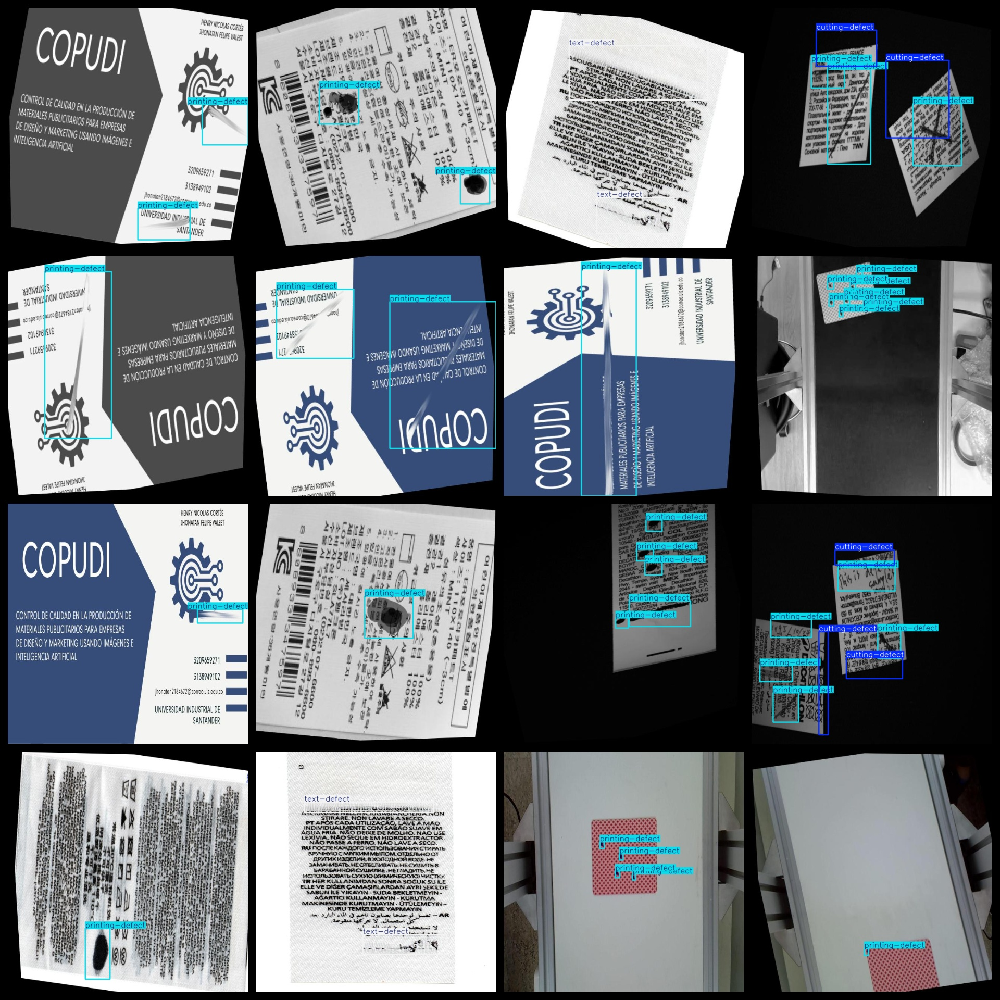
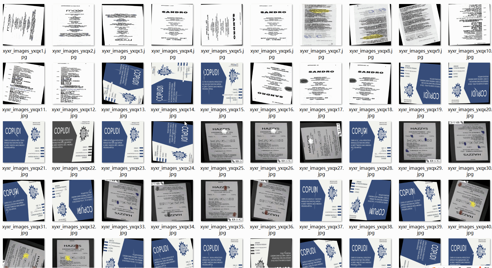

# [Object Detection] 3-class Printing Defect Dataset 1911 imagesYOLO+VOC format

[Object Detection] 3-class Printing Defect Dataset 1911 images in YOLO+VOC format

Dataset Format: VOC format + YOLO format

The package contains three folders, respectively storing images, xml, and txt files.

In the JPEGImages folder, there are a total of 1911 jpg images.

In the Annotations folder, there are a total of 1911 xml files.

In the labels folder, there are a total of 1911 txt files.

Number of label categories: 3

Label names: ["cutting-defect", "printing-defect", "text-defect"]

Label names: [“Cutting Defects”，“Printing Defects”，“Text Defects”]

Each label category has a frame count (Note that the order of classes in the Yolo format does not correspond to this, but is based on the classes.txt file in the labels folder):

cutting-defect frame count = 359

printing-defect frame count = 4716

text-defect frame count = 1367

Total frame count = 6442

Image resolution (pixel): Clear

Image enhancement status: Yes

Label shape: Rectangular boxes, used for target detection recognition

Important Notes: None

Special Statements: This dataset does not guarantee the accuracy or weights of trained models, only accurate and reasonable annotations are provided.

Annotation and Image Status:
## Images

---

Here is a pay link on Stripe (https://buy.stripe.com/3cs8yP7sY87d0vu9AB). Please contact me lonlonago@foxmail.com after funding $89, and I will send you a complete data files, thank you!

